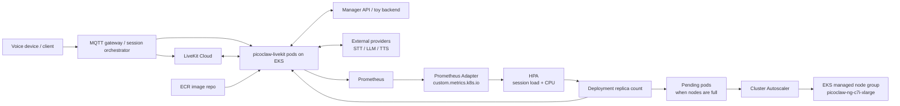

# Picoclaw LiveKit Deployment

Last updated: 2026-06-10

This folder contains the deployment entry point for the Picoclaw LiveKit voice agent. It is intended to be enough for a new developer to understand what runs in AWS, how the Kubernetes pieces fit together, how to ship a new image, how to verify a smoke test, and where the sharp edges are.

For the longer operational runbook, see `../docs/picoclaw-livekit-aws-eks-runbook.md`.

Run the commands in this README from `D:\picoclaw\deploy` unless a command says otherwise.

## Current Target

| Item | Value |
| --- | --- |
| LiveKit server | LiveKit Cloud |
| EKS cluster | `arn:aws:eks:ap-south-2:382188660865:cluster/picoclaw-eks` |
| AWS region | `ap-south-2` |
| Namespace | `picoclaw-dev` |
| Workload | `Deployment/picoclaw-livekit` |
| Agent name | `cheeko-agent1` |
| Image repo | `382188660865.dkr.ecr.ap-south-2.amazonaws.com/picoclaw-livekit` |
| Node group | `picoclaw-ng-c7i-xlarge` |
| Node type | `c7i.xlarge` |
| Node scaling | `minSize=2`, `desiredSize=2`, `maxSize=10` |
| Pod scaling | HPA `minReplicas=2`, `maxReplicas=10` |
| Autoscaler | Cluster Autoscaler |
| NetworkPolicy | Staged, not applied until CNI policy enforcement is enabled |

Assumptions for this deployment:

- Kubernetes APIs used here are `apps/v1`, `autoscaling/v2`, `policy/v1`, and `networking.k8s.io/v1`.
- The deployment method is raw Kubernetes YAML, plus Helm values for Prometheus Adapter.
- The cluster is EKS with AWS VPC CNI.
- Cluster Autoscaler image version should match the cluster minor version. The current manifest uses `registry.k8s.io/autoscaling/cluster-autoscaler:v1.35.0`; update it if the EKS cluster minor version changes.
- Do not treat the `.kind.yaml` files as production manifests. They are only for local/kind-style testing.

## Folder Map

```text
deploy/
  README.md
  config.json.example
  .security.yml.example
  docker-compose.livekit.yml
  k8s/
    livekit-deployment.yaml
    livekit-service.yaml
    livekit-hpa.yaml
    livekit-pdb.yaml
    livekit-podmonitor.yaml
    prometheus-adapter-values.yaml
    capacity-and-hardening.md
    livekit-deployment.kind.yaml
    livekit-service.kind.yaml
    cluster-autoscaler/
      README.md
      cluster-autoscaler.yaml
      iam-policy.json
      trust-policy.json
    network-policy/
      README.md
      livekit-networkpolicy.yaml
```

What each file is for:

| File | Purpose |
| --- | --- |
| `k8s/livekit-deployment.yaml` | Production EKS Deployment for the LiveKit worker. Contains image digest, probes, resources, security context, secrets, workspace volumes, and rollout strategy. |
| `k8s/livekit-capacity-test-deployment.yaml` | One-pod c6a.xlarge canary Deployment for measuring per-pod LiveKit voice-agent capacity without sending traffic to the production `cheeko-agent1` pool. |
| `k8s/livekit-service.yaml` | Internal Service exposing the worker health/metrics port `8192`. |
| `k8s/livekit-hpa.yaml` | HPA using session load and CPU. Primary metric is `picoclaw_livekit_session_load_percent`. |
| `k8s/livekit-pdb.yaml` | PDB allowing one voluntary disruption while keeping the two-pod baseline available. |
| `k8s/livekit-podmonitor.yaml` | Prometheus Operator scrape config for `/metrics` on port `8192`. Apply only if the cluster uses Prometheus Operator CRDs. |
| `k8s/prometheus-adapter-values.yaml` | Helm values that expose the session load metric through `custom.metrics.k8s.io` for HPA. |
| `k8s/cluster-autoscaler/` | Cluster Autoscaler manifest and IAM documents. Lets EKS add nodes when HPA creates pods that cannot schedule. |
| `k8s/network-policy/` | Staged NetworkPolicy and notes. Do not apply until network policy enforcement is enabled and tested. |
| `k8s/capacity-and-hardening.md` | Capacity math, cost baseline, hardening notes, and validation commands. |
| `config.json.example` | Minimal config file shape for Kubernetes secret input. |
| `.security.yml.example` | Minimal security file shape for Kubernetes secret input. Never commit real credentials. |
| `docker-compose.livekit.yml` | Local/container reference only. Production runs on EKS. |

## Architecture



Runtime flow:

1. The gateway creates or joins a LiveKit Cloud room for a device session.
2. LiveKit dispatches the `cheeko-agent1` worker.
3. One `picoclaw-livekit` pod accepts the job, joins the LiveKit room, subscribes to device audio, and publishes a TTS track.
4. The pod restores the device workspace from Manager API, takes a distributed workspace lock, and starts the voice pipeline.
5. STT, LLM, and TTS calls go to external provider APIs.
6. The worker exposes health and Prometheus metrics on port `8192`.
7. Prometheus Adapter exposes `picoclaw_livekit_session_load_percent` to HPA.
8. HPA adds pods when session load or CPU crosses target.
9. Cluster Autoscaler adds EKS nodes when new pods cannot fit on existing nodes.

## Scaling Model

The current worker setting is:

```text
PICOCLAW_LIVEKIT_MAX_SESSIONS=12
```

The HPA target for session load is `50`.

Session load is:

```text
active_sessions / max_sessions * 100
```

With `max_sessions=12`:

| Active sessions on one pod | Reported session load |
| --- | --- |
| 1 | about `8.3%` |
| 6 | about `50%` |
| 9 | about `75%` |
| 12 | `100%` |

How to interpret this:

- `12` is the configured ceiling, not the comfort target.
- HPA should start adding pods around 6 active sessions per pod.
- The two warm pods provide about 24 configured session slots before extra scale-out, but production capacity should be judged by latency, provider limits, and error rate.
- The HPA can scale to 10 pods, which is about 120 configured session slots.
- The node group can scale to 10 `c7i.xlarge` nodes.

The current AWS baseline keeps two `c7i.xlarge` nodes warm for the two minimum agent pods. This saves one always-on node compared with the earlier three-node baseline. Rolling updates or load spikes can still temporarily need a third node because each worker pod requests `3 vCPU` and `6Gi` memory; Cluster Autoscaler should add that capacity when new pods cannot schedule.

## Secrets And Config

The EKS pods do not read local developer files like `C:\Users\rahul\.picoclaw\config.json`.

Production pods mount:

| Kubernetes secret | Mounted/used as |
| --- | --- |
| `picoclaw-config` | `/etc/picoclaw/config.json` and `/etc/picoclaw/.security.yml` |
| `picoclaw-secrets` | Environment variables for Manager API and database URLs |

`picoclaw-config` must contain:

```text
config.json
.security.yml
```

`picoclaw-secrets` must contain keys referenced by `k8s/livekit-deployment.yaml`:

```text
manager_api_url
manager_api_secret
stt_database_url
direct_url
```

Create or refresh the config secret:

```powershell
$Context = "arn:aws:eks:ap-south-2:382188660865:cluster/picoclaw-eks"
$Namespace = "picoclaw-dev"

kubectl --context $Context -n $Namespace delete secret picoclaw-config --ignore-not-found
kubectl --context $Context -n $Namespace create secret generic picoclaw-config `
  --from-file=config.json=<path-to-config.json> `
  --from-file=.security.yml=<path-to-security.yml>
```

Do not commit real `config.json`, `.security.yml`, API keys, database URLs, or LiveKit secrets.

## Developer Access From Another Laptop

Developer access and pod access are separate.

The production pod has:

```yaml
automountServiceAccountToken: false
```

This only means the running `picoclaw-livekit` container does not receive an automatic Kubernetes API token at `/var/run/secrets/kubernetes.io/serviceaccount/token`. The voice agent does not need to list pods, read Kubernetes Secrets, create Jobs, or control the cluster, so removing that token reduces blast radius if the container is compromised.

This does not affect a developer, Codex, CI, `kubectl`, Helm, or AWS CLI from outside the cluster. A developer on another laptop still manages the deployment through AWS/IAM credentials and a local kubeconfig.

Setup on a new laptop:

```powershell
aws configure
aws eks update-kubeconfig --region ap-south-2 --name picoclaw-eks
kubectl config get-contexts
kubectl -n picoclaw-dev get pods
```

If the AWS account uses SSO or named profiles, use that profile:

```powershell
aws sso login --profile <profile-name>
aws eks update-kubeconfig --region ap-south-2 --name picoclaw-eks --profile <profile-name>
kubectl -n picoclaw-dev get pods
```

The IAM user or role must also be authorized for the EKS cluster through EKS access entries or the cluster's `aws-auth` mapping. If `kubectl` returns `Unauthorized`, fix the developer's AWS/EKS access; do not enable ServiceAccount token mounting on the application pod.

Never copy a ServiceAccount token out of a pod to make laptop access work. Laptop access should come from IAM, SSO, or another approved operator identity.

## Build And Push A Production Image

Production image builds use `../Dockerfile.eks`.

ECR tags are immutable and scan-on-push is enabled. Use a fresh tag for every build and deploy by digest, not by mutable tag.

```powershell
$AccountId = "382188660865"
$Region = "ap-south-2"
$RepoName = "picoclaw-livekit"
$Repo = "$AccountId.dkr.ecr.$Region.amazonaws.com/$RepoName"
$Tag = Get-Date -Format "yyyyMMdd-HHmmss"

aws ecr get-login-password --region $Region |
  docker login --username AWS --password-stdin "$AccountId.dkr.ecr.$Region.amazonaws.com"

docker build -f Dockerfile.eks -t "$Repo:$Tag" .
docker push "$Repo:$Tag"

$Digest = aws ecr describe-images `
  --region $Region `
  --repository-name $RepoName `
  --image-ids imageTag=$Tag `
  --query "imageDetails[0].imageDigest" `
  --output text

"$Repo@$Digest"
```

Then update `k8s/livekit-deployment.yaml` so the container image is pinned like:

```yaml
image: 382188660865.dkr.ecr.ap-south-2.amazonaws.com/picoclaw-livekit@sha256:<digest>
```

Before rollout, confirm the ECR scan is clean enough for the release:

```powershell
aws ecr describe-image-scan-findings `
  --region ap-south-2 `
  --repository-name picoclaw-livekit `
  --image-id imageTag=$Tag `
  --query "imageScanFindings.findingSeverityCounts"
```

## Deploy Order

Use the production EKS context:

```powershell
$Context = "arn:aws:eks:ap-south-2:382188660865:cluster/picoclaw-eks"
$Namespace = "picoclaw-dev"
```

Validate before applying:

```powershell
kubectl --context $Context apply --dry-run=server -f k8s/livekit-service.yaml
kubectl --context $Context apply --dry-run=server -f k8s/livekit-deployment.yaml
kubectl --context $Context apply --dry-run=server -f k8s/livekit-pdb.yaml
kubectl --context $Context apply --dry-run=server -f k8s/livekit-hpa.yaml
kubectl --context $Context apply --dry-run=server -f k8s/cluster-autoscaler/cluster-autoscaler.yaml
```

Apply the core workload:

```powershell
kubectl --context $Context apply -f k8s/livekit-service.yaml
kubectl --context $Context apply -f k8s/livekit-deployment.yaml
kubectl --context $Context apply -f k8s/livekit-pdb.yaml
kubectl --context $Context apply -f k8s/livekit-hpa.yaml
kubectl --context $Context -n $Namespace rollout status deployment/picoclaw-livekit
```

Apply Cluster Autoscaler only after the IAM role, OIDC trust, and ASG discovery tags are correct:

```powershell
kubectl --context $Context apply -f k8s/cluster-autoscaler/cluster-autoscaler.yaml
kubectl --context $Context -n kube-system rollout status deployment/cluster-autoscaler
```

Apply `k8s/livekit-podmonitor.yaml` only if Prometheus Operator CRDs exist:

```powershell
kubectl --context $Context get crd podmonitors.monitoring.coreos.com
kubectl --context $Context apply --dry-run=server -f k8s/livekit-podmonitor.yaml
kubectl --context $Context apply -f k8s/livekit-podmonitor.yaml
```

Install or update Prometheus Adapter with the values file after Prometheus is present:

```powershell
helm upgrade --install prometheus-adapter prometheus-community/prometheus-adapter `
  --namespace monitoring `
  --create-namespace `
  --kube-context $Context `
  -f k8s/prometheus-adapter-values.yaml
```

Do not apply `k8s/network-policy/livekit-networkpolicy.yaml` until the NetworkPolicy section below is satisfied.

## NetworkPolicy Status

The NetworkPolicy is staged but intentionally not applied.

Current reason:

```text
AWS VPC CNI network policy enforcement is disabled:
--enable-network-policy=false
```

If the policy object is applied while the CNI ignores it, Kubernetes will accept the object but traffic will not actually be restricted. That creates a false sense of security.

Safe enablement order:

1. Enable an EKS-supported NetworkPolicy engine, preferably through the managed `vpc-cni` addon.
2. Confirm `aws-node` is running with network policy enforcement enabled.
3. Server-dry-run the policy.
4. Apply during a maintenance window.
5. Verify DNS, LiveKit Cloud websocket, Manager API, STT/TTS/LLM provider calls, Postgres, and Prometheus scraping.

Commands:

```powershell
kubectl --context $Context apply --dry-run=server -f k8s/network-policy/livekit-networkpolicy.yaml
kubectl --context $Context apply -f k8s/network-policy/livekit-networkpolicy.yaml
kubectl --context $Context -n $Namespace get networkpolicy
```

Rollback:

```powershell
kubectl --context $Context -n $Namespace delete networkpolicy picoclaw-livekit-egress
```

## Verify After Deployment

Check rollout and object state:

```powershell
kubectl --context $Context -n $Namespace rollout status deployment/picoclaw-livekit
kubectl --context $Context -n $Namespace get deploy,hpa,pdb,svc
kubectl --context $Context -n $Namespace get pods -l app=picoclaw-livekit -o wide
kubectl --context $Context get nodes
```

Check image digest actually running:

```powershell
kubectl --context $Context -n $Namespace get pods -l app=picoclaw-livekit `
  -o jsonpath="{range .items[*]}{.metadata.name}{' '}{.status.containerStatuses[0].imageID}{'\n'}{end}"
```

Check logs while running a smoke test:

```powershell
kubectl --context $Context -n $Namespace logs -f -l app=picoclaw-livekit `
  --all-containers=true `
  --tail=200 `
  --since=10m `
  --max-log-requests=10 `
  --prefix=true
```

Healthy smoke-test markers:

```text
Job assignment received
Resolved per-session provider selection
Acquired manager distributed workspace lock
workspace fast-path restore completed
Joined room
Published local TTS track
Audio track subscribed
STT stream opened
TEN VAD speech start detected
LLM request config
Turn latency summary
Session quality summary
workspace-sync uploaded to manager
Released manager workspace lock
```

Warnings that may be noisy but are not automatically failures:

```text
Tool registration overwrites existing tool
Forced required workspace file tools for LiveKit agent
Received abort from gateway
```

`Received abort from gateway` is normal when the user interrupts, barge-in happens, or the session ends. Investigate it only if audio is being cut off unexpectedly.

## Verify HPA And Custom Metrics

Check HPA:

```powershell
kubectl --context $Context -n $Namespace get hpa picoclaw-livekit -o wide
kubectl --context $Context -n $Namespace describe hpa picoclaw-livekit
```

Check CPU/memory metrics:

```powershell
kubectl --context $Context -n $Namespace top pods
kubectl --context $Context top nodes
```

Check the custom session metric directly:

```powershell
kubectl --context $Context get --raw "/apis/custom.metrics.k8s.io/v1beta1/namespaces/picoclaw-dev/pods/*/picoclaw_livekit_session_load_percent?labelSelector=app%3Dpicoclaw-livekit"
```

Expected behavior:

- With no sessions, session load should be near zero.
- With one active session and `max_sessions=12`, a pod should report about `8.3`.
- HPA may display custom metric values with milli-unit formatting such as `4166m`. That means `4.166`, not 4166 percent.
- If the custom metric is `<unknown>`, check Prometheus, Prometheus Adapter, and the `custom.metrics.k8s.io` APIService.

## Verify Cluster Autoscaler

Check Cluster Autoscaler:

```powershell
kubectl --context $Context -n kube-system get deploy,pod -l app.kubernetes.io/name=cluster-autoscaler
kubectl --context $Context -n kube-system logs deployment/cluster-autoscaler --tail=120
```

Check node group scaling from AWS:

```powershell
aws eks describe-nodegroup `
  --region ap-south-2 `
  --cluster-name picoclaw-eks `
  --nodegroup-name picoclaw-ng-c7i-xlarge `
  --query "nodegroup.scalingConfig"
```

Cluster Autoscaler only adds nodes when pods are pending because existing nodes cannot fit them. HPA creates the extra pods; Cluster Autoscaler creates the extra nodes.

## Rollback

Rollback to the previous Deployment revision:

```powershell
kubectl --context $Context -n $Namespace rollout history deployment/picoclaw-livekit
kubectl --context $Context -n $Namespace rollout undo deployment/picoclaw-livekit
kubectl --context $Context -n $Namespace rollout status deployment/picoclaw-livekit
```

Rollback to a specific revision:

```powershell
kubectl --context $Context -n $Namespace rollout undo deployment/picoclaw-livekit --to-revision=<revision>
```

Rollback a bad manifest before apply by using `kubectl diff`:

```powershell
kubectl --context $Context diff -f k8s/livekit-deployment.yaml
```

Rollback NetworkPolicy if it was enabled and traffic breaks:

```powershell
kubectl --context $Context -n $Namespace delete networkpolicy picoclaw-livekit-egress
```

If a bad image was pushed but not applied, do not reuse the tag. ECR tags are immutable; build a new tag, get the new digest, update the manifest, and roll forward.

## Common Problems

### HPA shows `<unknown>`

Likely causes:

- Metrics Server is unavailable for CPU metrics.
- Prometheus Adapter is unavailable for custom metrics.
- Prometheus is not scraping `/metrics`.
- Adapter values do not match the Prometheus service name or metric labels.

Useful checks:

```powershell
kubectl --context $Context get apiservice | findstr custom.metrics.k8s.io
kubectl --context $Context -n monitoring get pods
kubectl --context $Context -n monitoring logs deployment/prometheus-adapter --tail=120
kubectl --context $Context get --raw "/apis/custom.metrics.k8s.io/v1beta1"
```

### Pods are pending

Likely causes:

- Node group max size is too low.
- Cluster Autoscaler is not running or lacks AWS permissions.
- Node selector requires `c7i.xlarge` nodes but none are available.
- EC2 vCPU quota or subnet capacity blocks scale-out.

Useful checks:

```powershell
kubectl --context $Context -n $Namespace describe pod <pending-pod-name>
kubectl --context $Context -n kube-system logs deployment/cluster-autoscaler --tail=160
aws service-quotas get-service-quota --region ap-south-2 --service-code ec2 --quota-code L-1216C47A
```

### Agent joins but user hears no response

Check for:

- `Audio track subscribed`
- `STT stream opened`
- `TEN VAD speech start detected`
- `LLM request config`
- `tts_first_audio`
- provider errors from STT/TTS/LLM

If no audio track is subscribed, start at LiveKit room/device/gateway state. If STT opens and VAD detects speech but LLM/TTS does not run, start at provider config and `.security.yml`.

### Workspace restore or lock fails

Check for:

- `Acquired manager distributed workspace lock`
- `workspace fast-path restore completed`
- `workspace-sync uploaded to manager`
- HTTP errors against Manager API

Likely causes are wrong `MANAGER_API_URL`, stale Manager API deployment, missing workspace lock routes, or bad `manager_api_secret`.

## Change Control Checklist

Before merging or handing off a deployment change:

- The image is built from `Dockerfile.eks`.
- The ECR scan is checked.
- `k8s/livekit-deployment.yaml` uses an image digest.
- `kubectl apply --dry-run=server` passes for changed manifests.
- `kubectl diff` is reviewed for production-impacting changes.
- Rollout status passes.
- At least one real voice smoke test passes.
- Logs show room join, audio subscription, STT, LLM, TTS, and session persistence.
- HPA shows CPU and custom session load metrics.
- Rollback command is known before the apply.

## Sources Of Truth

- Fast deploy entry point: this file.
- Full runbook: `../docs/picoclaw-livekit-aws-eks-runbook.md`.
- Capacity/security summary: `k8s/capacity-and-hardening.md`.
- Cluster Autoscaler details: `k8s/cluster-autoscaler/README.md`.
- NetworkPolicy status: `k8s/network-policy/README.md`.
